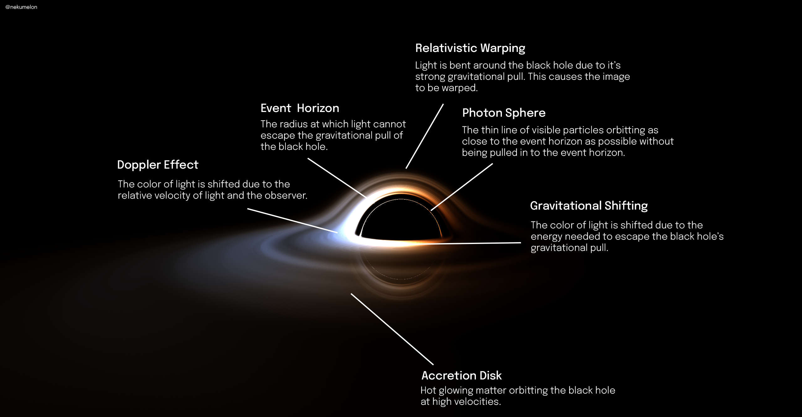

# Black Hole Ray Marcher V2

A black hole ray marcher with gravitational warping, doppler shifting, gravitational shifting, and blackbody temperature. This is a rewrite of my [first black hole ray marcher](https://github.com/nekumelon/BlackHoleRaytracer).



# Installing

To install the dependencies for the simulation, run the following command: `npm install`.
To install the dependencies for the image processor, run the following command:
`pip3 install -r requirements.txt`.

# Usage

Firstly create a simulation scene by editing the `default.scene.json` with the scene configuration.
Once a scene has been created, open a live server in the root directory of the project.
Then, open the `index.html` file in the browser. (In vscode you may use the `Live Server` extension).
Once it has finished rendering, the frames will be displayed, and a download button will appear, which will download a zip of the frames.

# Scene Configuration

The scene configuration is a JSON file, which contains the following properties:
- `resolution`: The resolution of the simulation, in pixels. Ex: `[1920, 1080]`.
- `maxIterations`: The maximum number of iterations per ray. Ex: `500`,
- `stepSize`: The size between each ray's step. Ex: 0.07,
- `diskInnerRadius`: The inner radius of the accretion disk. Ex: `2`,
- `diskOuterRadius`: The outer radius of the accretion disk. Ex: `70`,
- `diskTemperature`: The temperature of the blackhole. Ex: `4500`,
- `path`: The path the camera should follow and rotate on. Ex: ```[
        {
            "start": {
                "position": [-2, 2, -12],
                "rotation": [0, 0, 0]
            },
            "end": {
                "position": [-2, 0.1, -12],
                "rotation": [2, 0, 2]
            },
            "step": 0.005
        }
    ]```
- `camera`: If no path is specified, this will be used as the camera position. Ex: `[0, 2, -12]`,
- `camera`: If no path is specified, this will be used as the rotation. Ex: `[2, 0, 2]`,

# Processing

You can process the image files into a video using the `process.py` file. It takes the following arguments:

-   --framerate: The framerate of the video. `ex: 30`
-   --images: The path to the images to process. `ex: './images'`
-   --output: The path to the output video. `ex: './output'`
-   --autoplay: If true, the video will autoplay.

You can then run the processor with the following command: `python3 process.py <arguments>`

# LICENSE

See the [LICENSE](LICENSE.md) file for the license.

# Author

Created by @nekumelon
